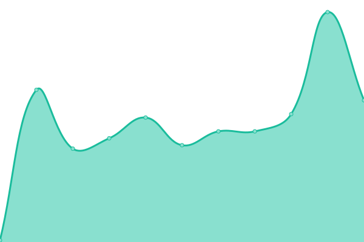
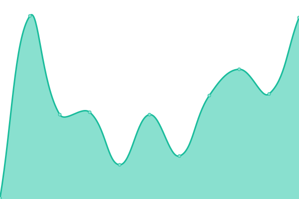
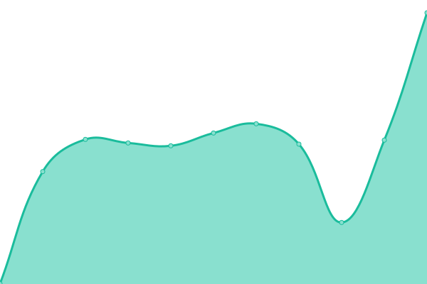
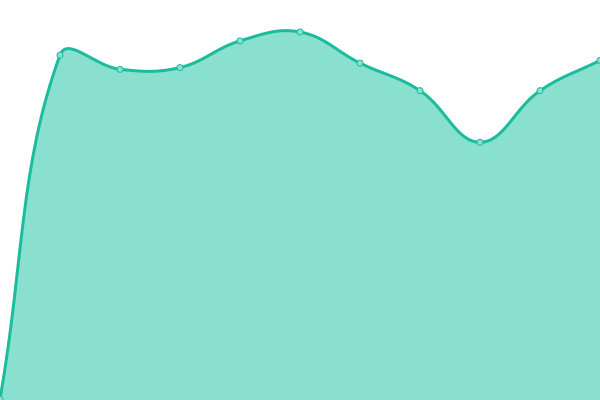
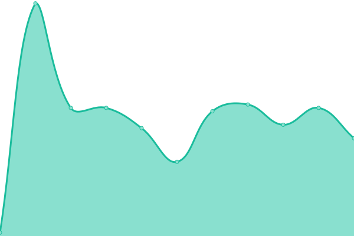

# PreMiD Status (unofficial)

Live status: <!--live status--> **🟨 Partial outage**  **🟨 Partial outage**  **🟨 Partial outage**  **🟨 Partial outage**

## [📈 Status](https://hans5958.me/PreMiD-Upptime)

_This section is updated automatically when the status of any site changes._

<!--start: status pages-->

| URL | Status | History | Response Time | Uptime |
| --- | ------ | ------- | ------------- | ------ |
| [Google](https://www.google.com) | 🟩 Up | [google.yml](https://github.com/koj-co/upptime/commits/master/history/google.yml) |  102ms | 
| [Wikipedia](https://en.wikipedia.org) | 🟩 Up | [wikipedia.yml](https://github.com/koj-co/upptime/commits/master/history/wikipedia.yml) |  122ms | 
| [Internet Archive](https://archive.org) | 🟩 Up | [internet-archive.yml](https://github.com/koj-co/upptime/commits/master/history/internet-archive.yml) |  581ms | 
| [Hacker News](https://news.ycombinator.com) | 🟩 Up | [hacker-news.yml](https://github.com/koj-co/upptime/commits/master/history/hacker-news.yml) |  388ms | 
| [Broken Site](https://thissitedoesnotexist.com) | 🟥 Down | [broken-site.yml](https://github.com/koj-co/upptime/commits/master/history/broken-site.yml) |  0ms | 
| Secret Site | 🟩 Up | [secret-site.yml](https://github.com/koj-co/upptime/commits/master/history/secret-site.yml) |  39ms | 

<!--end: status pages-->
