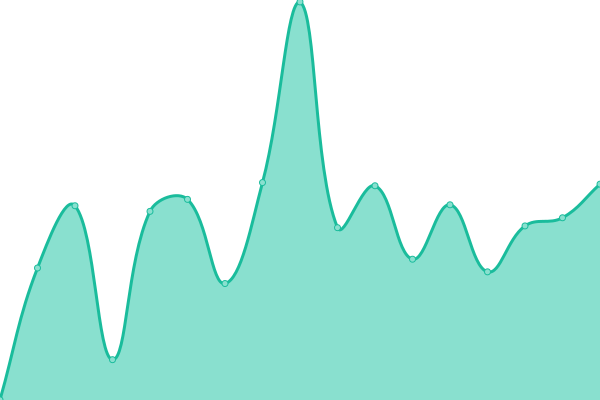

# PreMiD Status (unofficial)

Welcome to **PreMiD**'s (unofficial) Upptime status repository.

Sometimes [status.premid.app](https://status.premid.app) doesn't record downtimes. This website records downtimes for free, using only GitHub services, thanks to [Upptime](https://github.com/koj-co/upptime).

Live status: <!--live status--> **🟧 Partial outage**

## [📈 Status](https://premid-upptime.netlify.app/)

<!--start: status pages-->
<!-- This summary is generated by Upptime (https://github.com/upptime/upptime) -->
<!-- Do not edit this manually, your changes will be overwritten -->
<!-- prettier-ignore -->
| URL | Status | History | Response Time | Uptime |
| --- | ------ | ------- | ------------- | ------ |
|  [Main](https://premid.app) | 🟩 Up | [main.yml](https://github.com/Hans5958/PreMiD-Upptime/commits/HEAD/history/main.yml) | 

 858ms
     
 | 

<a href="https://premid-upptime.netlify.app/history/main">90.98%</a>
    

|  [Beta](https://beta.premid.app) | 🟥 Down | [beta.yml](https://github.com/Hans5958/PreMiD-Upptime/commits/HEAD/history/beta.yml) | 

 478ms
     
 | 

<a href="https://premid-upptime.netlify.app/history/beta">0.00%</a>
    

|  [Docs](https://docs.premid.app) | 🟩 Up | [docs.yml](https://github.com/Hans5958/PreMiD-Upptime/commits/HEAD/history/docs.yml) | 

 766ms
     
 | 

<a href="https://premid-upptime.netlify.app/history/docs">89.00%</a>
    

|  [API](https://api.premid.app/v3) | 🟩 Up | [api.yml](https://github.com/Hans5958/PreMiD-Upptime/commits/HEAD/history/api.yml) | 

 426ms
     
 | 

<a href="https://premid-upptime.netlify.app/history/api">87.62%</a>
    

<!--end: status pages-->

## 📄 License

- Code: [MIT](./LICENSE)
- Data in the `./history` directory: [Open Database License](https://opendatacommons.org/licenses/odbl/1-0/)
