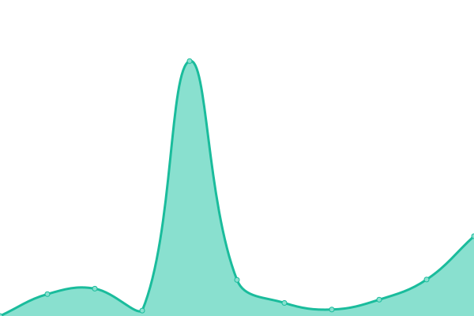
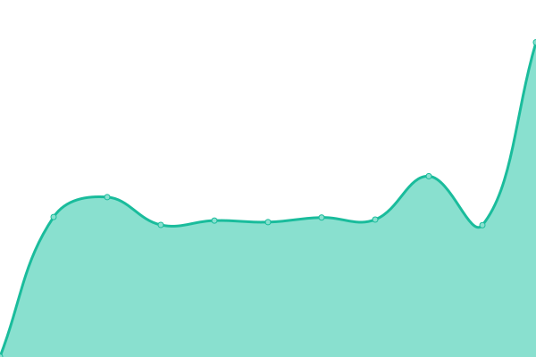

# PreMiD Status (unofficial)

Welcome to **PreMiD**'s (unofficial) Upptime status repository.

Sometimes [status.premid.app](https://status.premid.app) doesn't record downtimes. This website records downtimes for free, using only GitHub services, thanks to [Upptime](https://github.com/koj-co/upptime).

Live status: <!--live status--> **🟩 All systems operational**

## [📈 Status](https://premid-upptime.netlify.app/)

<!--start: status pages-->

| URL | Status | History | Response Time | Uptime |
| --- | ------ | ------- | ------------- | ------ |
| [Main](https://premid.app) | 🟩 Up | [main.yml](https://github.com/Hans5958/PreMiD-Upptime/commits/master/history/main.yml) |  3178ms | 
| [Beta](https://beta.premid.app) | 🟩 Up | [beta.yml](https://github.com/Hans5958/PreMiD-Upptime/commits/master/history/beta.yml) |  1887ms | 
| [Docs](https://docs.premid.app) | 🟩 Up | [docs.yml](https://github.com/Hans5958/PreMiD-Upptime/commits/master/history/docs.yml) |  583ms | 
| [API](https://api.premid.app) | 🟩 Up | [api.yml](https://github.com/Hans5958/PreMiD-Upptime/commits/master/history/api.yml) |  1112ms | 

<!--end: status pages-->

## 📄 License

- Code: [MIT](./LICENSE)
- Data in the `./history` directory: [Open Database License](https://opendatacommons.org/licenses/odbl/1-0/)
